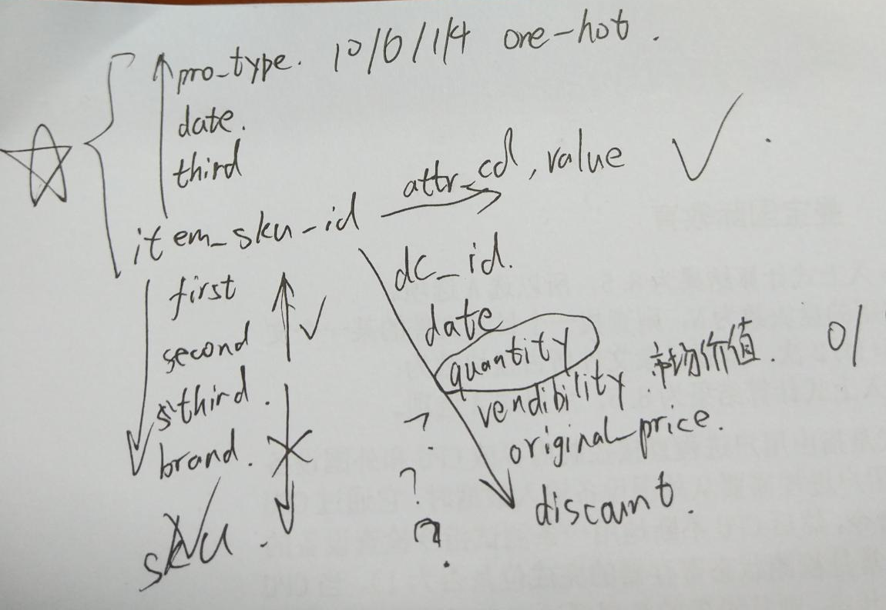
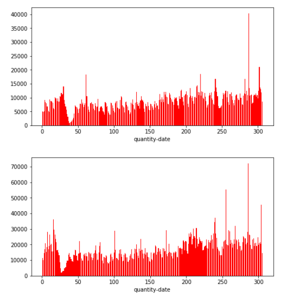
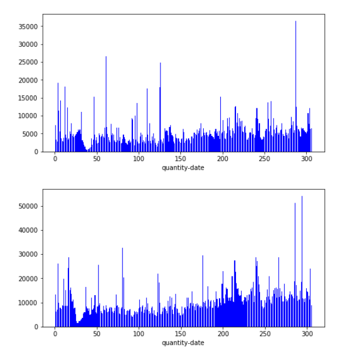
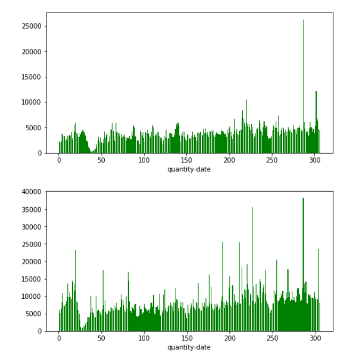
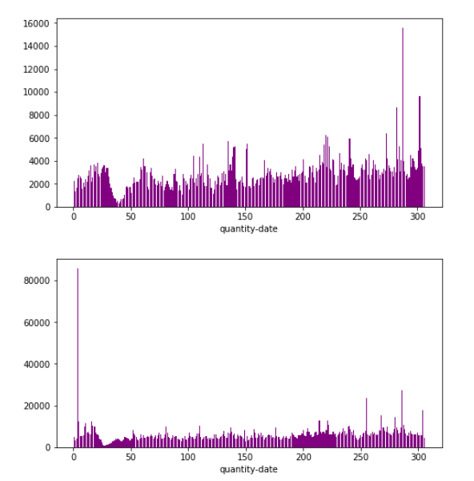
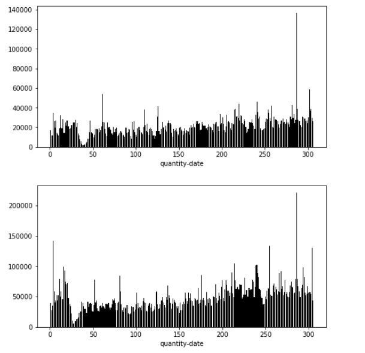

# 赛题地址

[GOC 仓储网络智能库存管理[初赛]/区域销售预测](https://jdata.jd.com/html/detail.html?id=4)

# python技巧
[pandas使用](./use_pandas.md)

# 组织架构

|序号|文件名|数据内容|
|----|-------------------------|----------------|
|1|sku_info.csv                |SKU基本信息      |
|2|sku_attr.csv                |SKU属性信息      |
|3|sku_prom.csv                |促销信息         |
|4|sku_sales.csv               |销售信息         |
|5|sku_prom_testing_2018Jan.csv|2018年1月促销信息 |
|6|sku_quantile.csv            |目标预测分位点    |

组织架构图

# 分析数据
## 整体分析
- 整个比赛数据结构图如上，是以sku_id为核心拓展
- info表中first、second third sku_id有种层级关系，就是说确定了下级上级一定唯一确定，这四个四选一即可，不用两两三三组合
- info表中brand不独立也就是说有些brand会对应多个维度。。甚至171号brand经营了7和6两个first，有且仅有这一个brand经营两种或以上first
- Attr表中attr和attr_values都不对应。。这里看上去有些奇怪但是确实存在一个values对应多个attr的情况
- Prom里面type只有10，6，4，1，测试集中同样只有这四种，考虑使用one-hot
- prom里面third还是和skuid对应的。。像info中一样，搞不清楚主办方搞这个做什么。。。
- Sales信息最多，目前可以肯定date的分布一定保证是连续的，但是有很多不是两年中全部数据都有，但是中间不会间断，因为count和数据间隔之间只差30的整数倍（6、11月数据的缺失导致），比如有的2016-07-15~2017-05-16这样
- vendibility是个布尔型的数（0/1），original_price很小理解成原价感觉好奇怪。。。Discount就是折扣率。。。Price和折扣率是不是和pro_type一一对应还有待验证（这数据划分的。。京东真不让人省心。。真混乱），如果不是一一对应真不知道这有啥用。。。测试集中又没有，只能作为历史信息。。感觉历史上折扣率平均值这种特征真心没用
- Vendibility啥意思？？是不是留了货？？？有啥用。。怎么用。。。不知道。。。
- 关于Prom：同一天可能有多种促销方式。。。。我们还是onehot吧。。。。
- 促销信息有重复！有重复！test里没有，所以我们相当于消去重复置为1
- Prom_type不分开只看组合之后分类，比如一个id就是（1，4，6，10）
- attr表里每个sku_id对应多个attr和attr_value啊！！！咋处理。。难道就提取每个sku有几个attr？几个attr_value??值太大，one-hot得话矩阵会异常稀疏特征巨多啊！！！
- 训练集，测试集: train2016->train201701  预测 train2017->test201801
训练集，验证集，调参：
train2016->train201701  预测 train201612_201711->train201712
- 想不清楚各个特征应该用sum还是mean.....
- 缺失值暂时不处理？
- 损失函数咋写啊
- 先对比看看吧 我们现在要解决的问题就是:
    - 决定自己的验证集好不好用 选一个与结果对应的验证集  
    - 人工去特征？看看重要性？ 
    - 看看损失函数 验证函数那边是不是可以改进 提高效率 
    - xgboost调参 
    - 尝试其他的模型 
    - 自定义的损失函数 验证函数那边应该没问题了是嘛 
    - 深入理解 弄一些新的特征

## 具体分析
- dc_id=0

- dc_id=1

- dc_id=2

- dc_id=3

- dc_id=0,1,2,3

- 每年分布规律大致和上年相同，但是数值上确都接近翻倍，整体分布还是呈现一个连续的过程，考虑着重提取2018-1月之前几个月的信息，这部分建议用sum，让机器学习到附近连续的规律去确定销量的基值（直流成分。。。。），而提取2017-1月信息的时候我们要尽量使用mean（）消除绝对销量的影响去学习波动的规律（谐波成分。。。。）
- 看数据分布还是春节有个下凹，可以考虑把二月数据删除，然后有一些异常高的数值例如年末那里，也可以考虑删除
- dc_id=是one-hot呢还是分别训练学习呢。。。？感觉都是一个问题必然有共性，数据量又有点小预计的特征数还很多我们还是one-hot吧。。。（注意它本身还是要作为历史数据merge的id的）
- 历史数据的划分和学习范围是很值得深究和思考的部分的感觉。。。
